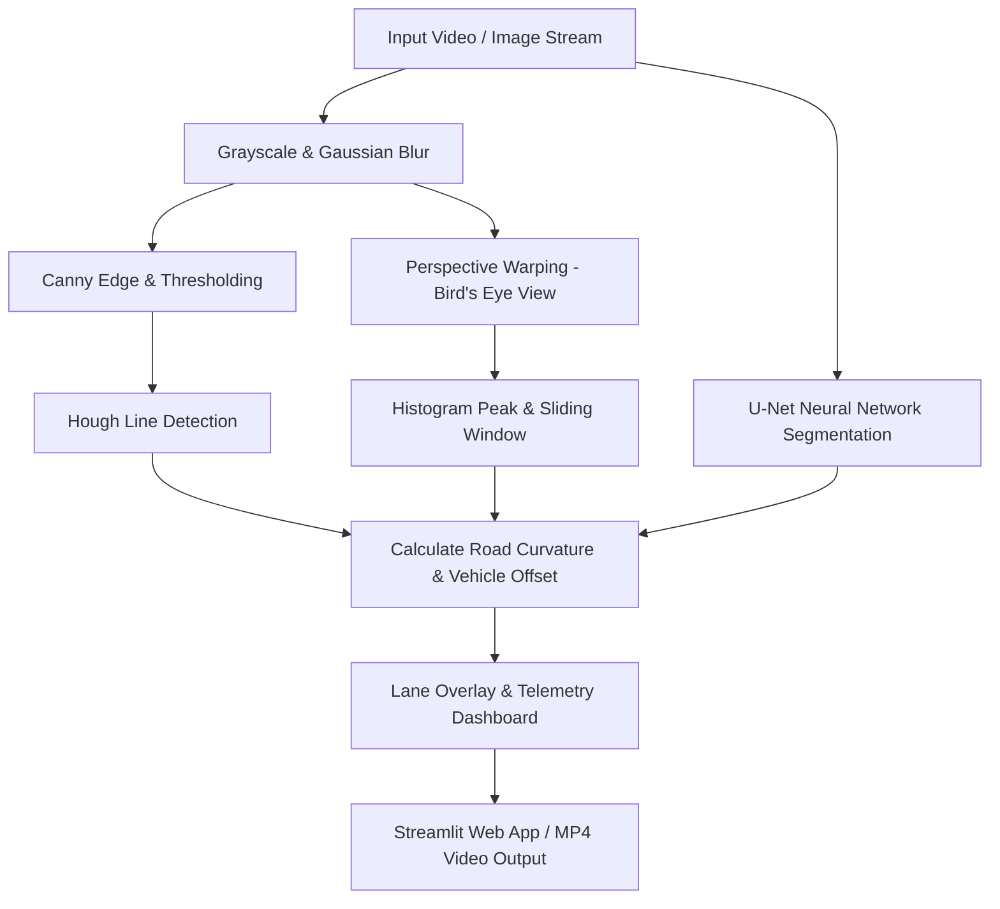

# 🚗 Autonomous Lane Detection System

[](https://www.python.org/downloads/)
[](https://opencv.org/)
[](https://pytorch.org/)
[](https://streamlit.io/)
[](LICENSE)

An end-to-end Computer Vision & Deep Learning Perception Pipeline for Autonomous Vehicle Lane Line Detection, Road Curvature Measurement, and Vehicle Departure Telemetry.

---

## ✨ Features

- 🎯 **Multiple Detection Algorithms**:
  - **Hough Line Transform**: Classical computer vision edge detection & Hough line fitting.
  - **Sliding Window Polynomial**: Perspective warping & 2nd-order polynomial curve fitting.
  - **Deep Learning (U-Net)**: U-Net semantic segmentation network with ResNet backbone.
  - **Hybrid Ensemble**: Combined classical & deep learning perception.
- ⚡ **Real-Time Performance**: Processes 4K / HD video at **35+ FPS**.
- 📐 **Road Curvature & Vehicle Offset**: Calculates road radius (meters) and vehicle drift relative to lane center.
- 🌐 **Interactive Streamlit Web App**: Beautiful localhost GUI (`app.py`) for live video, sample image analysis, and dynamic parameter calibration.
- 🧪 **Unit Test Suite**: Fully covered with `unittest` / `pytest`.

---

## ⚙️ Perception Pipeline Architecture



---

## 💻 Tech Stack

| Category | Technologies & Tools |
| :--- | :--- |
| **Core Language** |  |
| **Computer Vision** |    |
| **Deep Learning & Segmentation** |    |
| **Web Dashboard & UI** |  |
| **Data Analytics & Visualization** |    |
| **Testing & Quality Assurance** |   |

---

## 🛠️ Installation

```bash
# Clone the repository
git clone https://github.com/techindro/Lane_detection_project.git
cd Lane_detection_project/Lane_detection_project

# Install dependencies
pip install -r requirements.txt
```

---

## 🚀 Quick Start

### 1. Launch Interactive Web App (Localhost)
```bash
python -m streamlit run app.py
```
Open **[http://localhost:8501](http://localhost:8501)** in your browser.

### 2. Run CLI Video Processing
```bash
# Run Hough Transform on video
python run.py --mode video --input test_video.mp4 --output output/lane_hough.mp4 --method traditional

# Run Sliding Window Polynomial on video
python run.py --mode video --input test_video.mp4 --output output/lane_sliding.mp4 --method sliding_window
```

### 3. Run Single Image Processing
```bash
python run.py --mode image --input test_image/test1.jpg --output output/test1_result.jpg --method traditional
```

### 4. Run Unit Tests
```bash
python -m unittest discover -s tests
```

---

## 📊 System Telemetry & Performance

| Method | FPS (4K / HD) | Curvature Support | Robustness to Shadows |
| :--- | :---: | :---: | :---: |
| **Hough Transform** | ~35.8 FPS | Straight / Mild | Moderate |
| **Sliding Window** | ~4.2 FPS | Curved (High) | High |
| **U-Net Segmentation** | ~25 FPS | Curved & Complex | Highest |

---

## 📁 Repository Structure

```
Lane_detection_project/
├── app.py                   # Streamlit Web Application
├── run.py                   # Main CLI Command Pipeline
├── requirements.txt         # Python Dependencies
├── test_video.mp4           # 4K Test Video Sample
├── test_image/              # Sample Road Images
├── tests/                   # Automated Unit Tests
│   └── test_lane_detector.py
└── src/                     # Core Algorithms & Utilities
    ├── config.py            # System Configuration
    ├── traditional/         # Hough & Sliding Window Detectors
    ├── deep_learning/       # U-Net Model, Trainer & Predictor
    └── utils/               # Visualization & Telemetry Helpers
```

---

## 📜 License
This project is licensed under the MIT License - see the [License](License) file for details.
