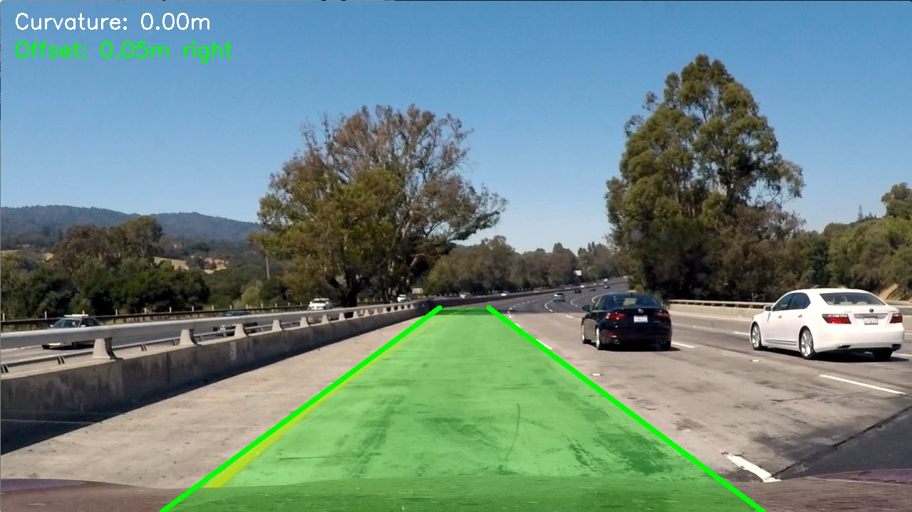

# Lane Detection Project

A Python and OpenCV project for detecting road lane lines from images and video feeds. It includes traditional computer vision methods (Hough Transform, Sliding Window) and deep learning models, along with a web dashboard built with Streamlit.

## Features

- **Hough Line Detection**: Fast edge detection and line fitting for straight highways.
- **Sliding Window Method**: Perspective transformation and 2nd-order polynomial fitting for curved roads.
- **Deep Learning Model**: U-Net semantic segmentation network.
- **Road Metrics**: Calculates road curvature radius and vehicle position offset from lane center.
- **Streamlit Web Interface**: Web dashboard to test images, videos, and adjust parameters locally.

## Localhost Web Interface

You can run the web dashboard locally on your computer to test lane detection interactively in your browser.

1. Start the Streamlit server:
```bash
python -m streamlit run app.py
```

2. Open the localhost URL in your browser:
**http://localhost:8501**

## Demo Result



- **Sample Image Output**: [View Result Image](output/test1_result.jpg)

## Tech Stack

- **Language**: Python 3.9+
- **Libraries**: OpenCV, PyTorch, NumPy, Matplotlib, Streamlit, Scikit-Learn

## Getting Started

### Prerequisites

Before running this project, ensure you have the following installed:

- **Python 3.9+** (Python 3.9, 3.10, 3.11, or 3.12)
- **pip** (Python package manager)
- **Git** (for cloning the repository)
- **FFmpeg** (optional, for processing MP4 video files)

### 1. Installation

Clone the repository and install required packages:

```bash
git clone https://github.com/techindro/Lane_detection_project.git
cd Lane_detection_project/Lane_detection_project
pip install -r requirements.txt
```

### 2. Run the Web App (Localhost)

```bash
python -m streamlit run app.py
```
Access at **http://localhost:8501**

### 3. Run Command Line Script

Process a test image:
```bash
python run.py --mode image --input test_image/test1.jpg --output output/result.jpg --method traditional
```

Process a test video:
```bash
python run.py --mode video --input test_video.mp4 --output output/video_result.mp4 --method traditional
```

### 4. Run Unit Tests

```bash
python -m unittest discover -s tests
```

## Project Structure

```
Lane_detection_project/
├── app.py              # Streamlit web application
├── run.py              # Command line runner script
├── requirements.txt    # Project dependencies
├── test_video.mp4      # Sample road video
├── test_image/         # Sample road images
├── tests/              # Automated unit tests
└── src/                # Source code
    ├── config.py       # Configuration settings
    ├── traditional/    # Hough and Sliding Window algorithms
    ├── deep_learning/  # Neural network model and trainer
    └── utils/          # Visualization and metric helpers
```

## License

This project is licensed under the MIT License - see the [License](License) file for details.
